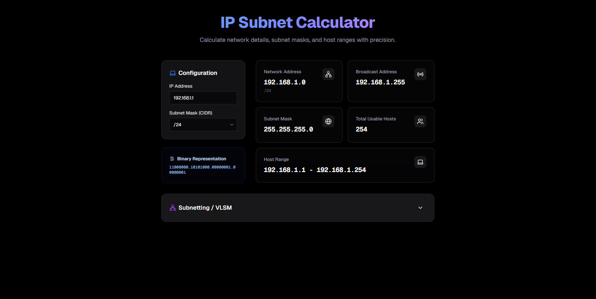
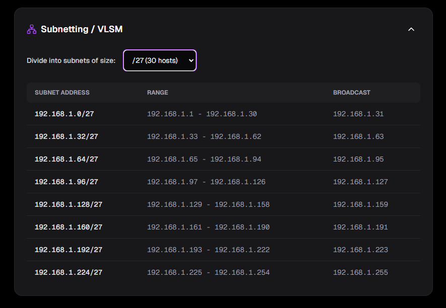

# 🌐 IP Calculator

<div align="center">


<br />


<br />

> A modern, high-performance IP Subnet Calculator built with **Next.js 16**, **TypeScript**, and **Tailwind CSS**.

<a href="https://ip-calculator-hazel.vercel.app/">
  
</a>

[Features](#-features) • [Tech Stack](#-tech-stack) • [Getting Started](#-getting-started) • [Screenshots](#-screenshots) • [Contributing](#-contributing)

</div>

---

## ✨ Features

- **🚀 Real-time Calculation**: Instantly calculate network details as you type.
- **🎯 Precision**: Accurate results for Network Address, Broadcast Address, and Host Ranges.
- **🔢 Subnetting / VLSM**: Easily divide networks into smaller subnets with a visual table.
- **🌗 Dark Mode**: Fully responsive dark and light mode support.
- **🎨 Beautiful UI**: Modern, glassmorphism-inspired design with smooth animations and gradients.
- **⚡ Fast**: Built on the latest Next.js stack for optimal performance.

## 🛠️ Tech Stack

- **Framework**: [Next.js 16](https://nextjs.org/) (App Router)
- **Language**: [TypeScript](https://www.typescriptlang.org/)
- **Styling**: [Tailwind CSS v4](https://tailwindcss.com/)
- **Icons**: [Lucide React](https://lucide.dev/)
- **Utils**: `clsx`, `tailwind-merge`

## 🚀 Getting Started

Follow these steps to run the project locally:

### Prerequisites

- Node.js 18+ installed
- npm, yarn, pnpm, or bun

### Installation

1. **Clone the repository**
   ```bash
   git clone https://github.com/your-username/ip-calculator.git
   cd ip-calculator
   ```

2. **Install dependencies**
   ```bash
   npm install
   # or
   yarn install
   ```

3. **Run the development server**
   ```bash
   npm run dev
   ```

4. **Open your browser**
   Navigate to [http://localhost:3000](http://localhost:3000) to see the app in action.

## 📸 Screenshots

<div align="center">
  
  
</div>

## 🧪 Running Tests

To verify the IP calculation logic, run the included test script:

```bash
npx tsx app/utils/test-ip-logic.ts
```

## 🤝 Contributing

Contributions are welcome! Please feel free to submit a Pull Request.

1. Fork the project
2. Create your feature branch (`git checkout -b feature/AmazingFeature`)
3. Commit your changes (`git commit -m 'Add some AmazingFeature'`)
4. Push to the branch (`git push origin feature/AmazingFeature`)
5. Open a Pull Request

## 📝 License

Distributed under the MIT License. See `LICENSE` for more information.

---

<p align="center">
  <a href="#-ip-calculator">Back to Top ⬆️</a>
</p>

<p align="center">
  Made with ❤️ by <a href="https://github.com/kaua-alves-queiros">Kauã Alves Queirós</a>
</p>
